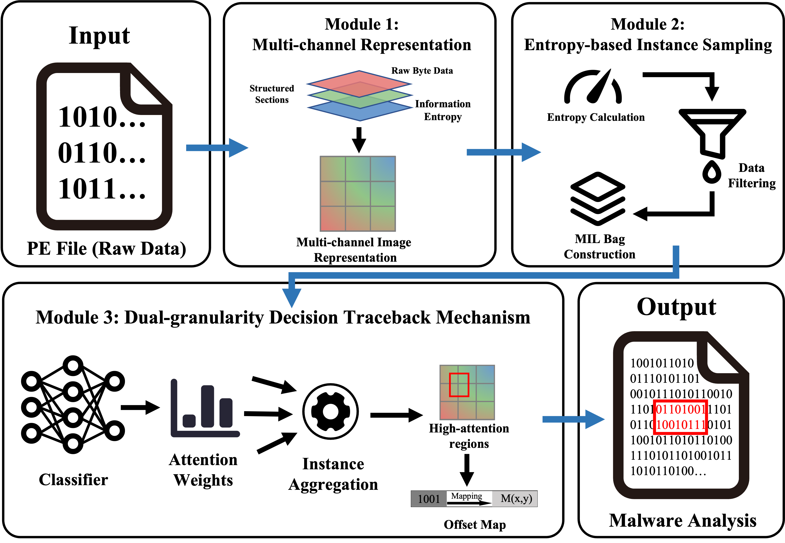
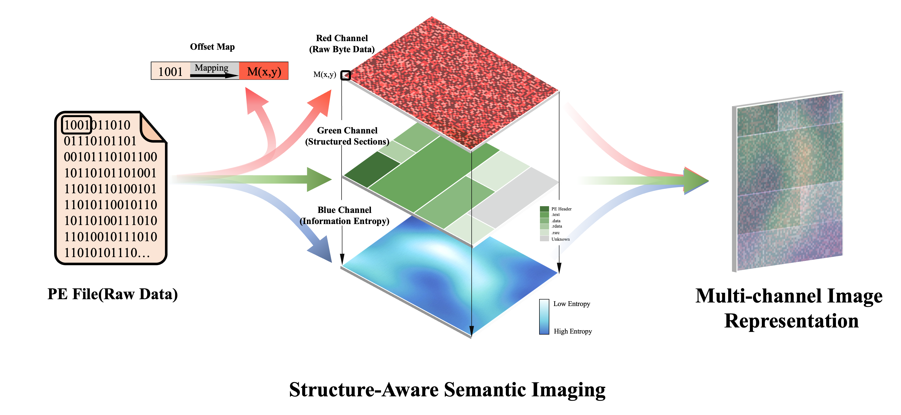
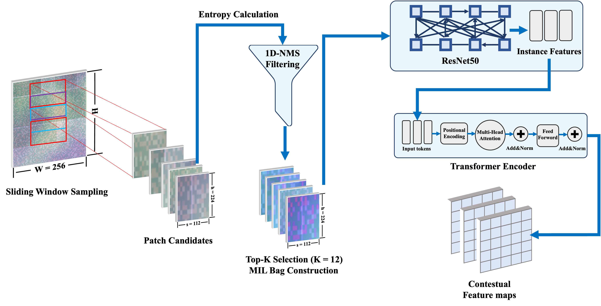
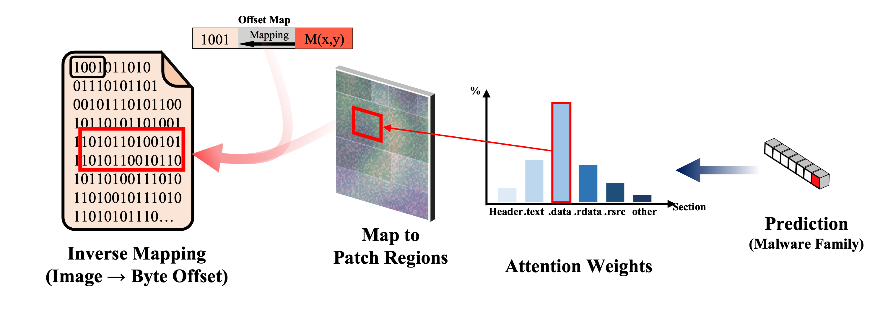

# Beyond Semantic Drift: High-Fidelity Byte-Level Malware Attribution via Structure-Aware MIL

> Paper: *Beyond Semantic Drift: High-Fidelity Byte-Level Malware Attribution via Structure-Aware MIL*

PyTorch implementation of **Structure-Aware Multiple Instance Learning (SA-MIL)** for fine-grained Windows PE malware family classification with deterministic physical byte-level traceback.

## Overview

Image-based malware classification faces a fundamental limitation: **semantic drift** — the disruption of deterministic pixel-to-byte correspondence caused by spatial transformations (global scaling, fixed cropping) during binary-to-image conversion.

SA-MIL addresses this through three synergistic modules:

1. **Structure-Aware Semantic Imaging** — Folds PE bytes into multi-channel RGB images (R=raw bytes, G=section boundaries, B=local entropy) while strictly preserving pixel–offset correspondence via deterministic mapping $\mathcal{M}(x,y) \to \langle \text{Offset}, \text{Section} \rangle$.
2. **Entropy-Driven Instance Sampling** — Filters redundant low-information regions through saliency scoring and 1D Non-Maximum Suppression (IoU=0.3), dynamically focusing on the top-12 most discriminative instances to circumvent memory bottlenecks.
3. **Dual-Granularity Decision Traceback** — Maps instance-level attention weights back to precise physical byte intervals ($\mathcal{O}(1)$ inverse), providing addressable attribution anchors directly importable into IDA Pro.

## Method

### Overview: SA-MIL Framework



*SA-MIL framework overview: Module 1 folds bytes into RGB images via $\mathcal{M}(x,y)$; Module 2 constructs MIL bags through entropy-driven sampling; Module 3 inversely maps attention to physical byte intervals.*

### Module 1: Structure-Aware Semantic Imaging



*Structure-aware imaging: R-channel (raw bytes), G-channel (section priors), B-channel (local entropy), with deterministic offset mapping.*

### Module 2 & 3: Instance Sampling and Transformer Aggregation



*Entropy-driven sampling, ResNet-50 encoding, and Transformer global stitching pipeline.*

### Inverse Mapping: Byte-Level Attribution



*Attention weights are inversely mapped through $\mathcal{M}(x,y)$ to contiguous byte intervals, enabling analysts to directly inspect flagged offsets.*

---

### Pipeline

```
PE File → Multi-Channel RGB Image 
        → Entropy-Weighted Sliding Window Sampling + 1D-NMS 
        → ResNet-50 Instance Encoder 
        → Position-Encoded Transformer Aggregator 
        → Gated Attention Pooling → Family Classification
        → Attention-Weights → Inverse Offset Mapping → Byte-Level Attribution
```

### Key Results

| Metric | Value |
|--------|-------|
| **Macro-F1 (single model)** | **98.80%** |
| **Macro-F1 (ensemble + TTA)** | **99.28%** |
| **Deletion Test (10% occlusion)** | **22.70% confidence drop** |
| Dataset | 3,963 PE samples, 6 families (MalwareBazaar) |

SA-MIL outperforms all evaluated baselines — including MalConv2 (96.37%), AB-MIL (95.52%), and IMCFN (94.97%) — while providing faithful, physically verifiable attribution.

## Project Structure

```
├── README.md
├── LICENSE
├── requirements.txt
├── .gitignore
│
├── data/                          # Data preparation scripts
│   ├── download.py                # Download samples from MalwareBazaar API
│   ├── unlock.py                  # Unlock password-protected archives
│   ├── reorganize.py              # Reorganize files by family
│   ├── generate_labels.py         # Generate label CSV files
│   ├── split_and_organize.py      # Train/val/test split (70/15/15)
│   ├── validate_no_leak.py        # SHA-256 deduplication & leakage check
│   ├── labels/                    # Ground-truth label files
│   │   ├── MalwareBazaar_Labels.csv        # Raw download labels (3,971 samples)
│   │   └── Existing_labels.csv             # Filtered labels (3,963 samples, matches paper)
│   ├── malware_images/            # Generated image dataset
│   │   ├── train.csv / val.csv / test.csv  # Data splits
│   │   ├── images/                # Multi-channel RGB images by family
│   │   └── offset_maps/           # PE section offset lookup tables
│   ├── malware_samples_raw/       # Raw downloaded ZIPs (.gitignored)
│   └── malware_samples_pe/        # Unlocked PE files (.gitignored)
│
├── src/
│   ├── preprocessing/
│   │   ├── b2image.py             # PE → multi-channel RGB (+ offset maps)
│   │   ├── find_offset.py         # Locate PE section offsets via pefile
│   │   └── file_offset.py         # Validate pixel-to-offset mapping
│   │
│   ├── models/
│   │   ├── mil_v11.py             # SA-MIL v11 (RandAugment + Label Smoothing)
│   │   └── mil_v12.py             # SA-MIL v12 (Entropy-Driven Saliency Sampling)
│   │
│   ├── training/
│   │   ├── evaluate.py            # Multi-seed ensemble + TTA evaluation
│   │   └── visualize.py           # Training curves & confusion matrix plots
│   │
│   ├── explain/
│   │   ├── explain_with_offset.py # ResNetMIL wrapper exposing attention weights
│   │   ├── explain.py             # Family-level section attention profiling
│   │   ├── trace_attention.py     # Per-sample attention → byte offset tracing
│   │   ├── grad_cam.py            # Grad-CAM (via pytorch-grad-cam library)
│   │   ├── grad_cam_alt.py        # Stitched heatmap overlay generation
│   │   ├── visualize_attention.py # Attention heatmap on original images
│   │   └── analysis_model.py      # Model helper for explainability (v11)
│   │
│   ├── baseline/
│   │   ├── malconv.py             # MalConv (Raff et al., 2017) — 1D CNN, 64KB truncation
│   │   ├── malconv2.py            # MalConv2 (Raff et al., 2021) — full-byte gated conv
│   │   ├── resnet_cnn.py          # ResNet-18 — image-level classification (global scaling)
│   │   ├── peer_methods.py        # 4 peer methods: IMCFN (VGG16), ViT-B/16, AB-MIL, TransMIL
│   │   ├── samil_fair.py          # SA-MIL fair-condition (same budget as peers)
│   │   └── generate_cam.py        # Baseline Grad-CAM comparison visualizations
│   │
│   └── ablation/
│       ├── channel_ablation.py    # R/G/B channel contribution experiments
│       ├── flip_v11.py            # HorizontalFlip augmentation test (v11)
│       ├── flip_v12.py            # HorizontalFlip augmentation test (v12)
│       ├── deletion_test.py       # Controlled occlusion / Deletion Test (XAI faithfulness)
│       ├── deletion_curve.py      # Deletion/Insertion metric curve plotting
│       ├── run_pure_test.py       # Pure evaluation (no augmentation, single seed)
│       ├── visualize_windows.py   # Window sampling strategy visualization
│       ├── plot_charts.py         # Channel ablation result charts
│       └── plot_charts2.py        # Additional ablation charts
│
├── results/
│   ├── checkpoints/               # Trained model weights (*.pth) — v12, baselines, ablations
│   ├── figures/                   # Generated figures (*.png, *.pdf)
│   ├── tables/                    # Result tables (*.csv, *.json)
│   └── reports/                   # Test reports (*.txt, *.docx)
│
├── configs/                       # Configuration templates
│
└── docs/
    └── region_2a000_380ff.bin     # Sample PE snippet for explainability demo
```

## Dataset

**MalwareBazaar** — 3,963 Windows PE samples across 6 malware families (from `data/labels/Existing_labels.csv`):

| Family | Total | Train (70%) | Val (15%) | Test (15%) |
|--------|-------|-------------|-----------|------------|
| njrat | 939 | 656 | 141 | 142 |
| Trickbot | 880 | 616 | 132 | 132 |
| Gozi | 768 | 537 | 115 | 116 |
| GuLoader | 586 | 410 | 88 | 88 |
| IcedID | 580 | 404 | 87 | 89 |
| Heodo | 210 | 148 | 29 | 33 |
| **Total** | **3,963** | **2,771** | **592** | **600** |

All samples SHA-256 deduplicated to prevent cross-set leakage. `data/labels/MalwareBazaar_Labels.csv` (3,971 samples) is the raw download before filtering.

## Setup

### Requirements

```bash
pip install -r requirements.txt
```

### Data Preparation

```bash
# 1. Download samples from MalwareBazaar
python data/download.py

# 2. Unlock password-protected archives
python data/unlock.py

# 3. Convert PE → multi-channel RGB images
python src/preprocessing/b2image.py \
    --input_dir data/malware_samples_pe \
    --output_dir data/malware_images/images

# 4. Generate labels and split dataset
python data/generate_labels.py
python data/split_and_organize.py

# 5. Validate no data leakage
python data/validate_no_leak.py
```

## Training

### SA-MIL v12 (main model)

The flagship model uses entropy-driven saliency sampling with 1D NMS for large files:

```bash
python src/models/mil_v12.py
```

Key hyperparameters (configurable at the top of `src/models/mil_v12.py`):

| Parameter | Default | Description |
|-----------|---------|-------------|
| `FIXED_WIDTH` | 256 | Image width (byte folding column count) |
| `WINDOW_H` | 224 | Sliding window height |
| `WINDOW_STRIDE` | 112 | Window stride |
| `MAX_WINDOWS` | 12 | Max instances per bag (entropy selection) |
| `HIDDEN_DIM` | 512 | Transformer hidden dimension |
| `SEEDS` | [42, 123, 456] (v11), [123] (v12) | Random seeds for ensemble |
| `MAX_EPOCHS` | 50 | Training epochs |

### SA-MIL v11

The v11 baseline uses RandAugment + label smoothing:

```bash
python src/models/mil_v11.py
```

### Baselines

SA-MIL is evaluated against **8 baseline methods** spanning three categories:

| Category | Method | Script |
|----------|--------|--------|
| **Long-Seq (Truncation)** | MalConv (Raff et al., 2017) — 1D CNN, 64KB truncation | `src/baseline/malconv.py` |
| **Long-Seq (Full-length)** | MalConv2 (Raff et al., 2021) — full-byte gated conv | `src/baseline/malconv2.py` |
| **Vision (Global Scale)** | ResNet-18 — forced 224×224 scaling | `src/baseline/resnet_cnn.py` |
| **Vision (Global Scale)** | IMCFN (Vasan et al., 2020) — VGG16 transfer | `src/baseline/peer_methods.py` |
| **Vision (Global Scale)** | ViT-B/16 (Dosovitskiy et al., 2021) | `src/baseline/peer_methods.py` |
| **MIL (Gated Attention)** | AB-MIL (Ilse et al., 2018) | `src/baseline/peer_methods.py` |
| **MIL (CLS Token)** | TransMIL (Shao et al., 2023) | `src/baseline/peer_methods.py` |
| **MIL (Fair Condition)** | SA-MIL fair (same budget as peers) | `src/baseline/samil_fair.py` |

```bash
python src/baseline/malconv.py
python src/baseline/malconv2.py
python src/baseline/resnet_cnn.py
python src/baseline/peer_methods.py
python src/baseline/samil_fair.py
```

### Multi-Seed Ensemble Evaluation

```bash
python src/training/evaluate.py
```

Loads multiple trained checkpoints and runs ensemble with TTA, saving results to `results/reports/` and `results/figures/`.

## Multi-Channel Imaging

SA-MIL's structure-aware imaging encodes each PE byte into a 3-channel pixel via:

- **R-channel** (Raw Bytes): $P_R(i) = b_i$ — directly preserves Opcode sequences and local data patterns.
- **G-channel** (Section Priors): PE section topology mapped to discrete values (`.text`→32, `.rdata`→64, `.data`→128, `.rsrc`→160, others per RWX permissions) — introduces high-frequency edges at section boundaries.
- **B-channel** (Local Entropy): Shannon entropy over a 256-byte sliding window, scaled to [0,255] — highlights encrypted/compressed payloads.

The inverse mapping $\mathcal{M}(x,y) \to \langle \text{Offset}, \text{Section} \rangle$ achieves $\mathcal{O}(1)$ resolution, enabling lossless traceback from attention weights to physical byte intervals.

## Explainability

```bash
# Family-level section attention profiling (RQ3)
python src/explain/explain.py

# Per-sample attention tracing → byte offsets
python src/explain/trace_attention.py

# Grad-CAM visualization (via pytorch-grad-cam)
python src/explain/grad_cam.py

# Alternative Grad-CAM with stitched heatmap overlays
python src/explain/grad_cam_alt.py

# Attention heatmap overlay on original images
python src/explain/visualize_attention.py
```

### Controlled Deletion Test (XAI Faithfulness)

The deletion test systematically zeros the top-k% high-attention regions and measures confidence degradation (see `src/ablation/deletion_test.py`):
- **SA-MIL**: 22.70% confidence drop at 10% occlusion, 33.24% at 50%
- **Baseline Grad-CAM**: only 3.63% drop at 50% occlusion

## Ablation Studies

### Channel Contribution

Channel configurations and test-set Macro-F1:

| Configuration | Description | Macro-F1 |
|---------------|-------------|----------|
| R only | Raw bytes alone (no section priors, no entropy) | 93.17% |
| RG | Bytes + section boundaries | 95.33% |
| RB | Bytes + local entropy | 95.41% |
| **RGB** | **Full synergy** | **98.80%** |

### Augmentation Strategy

| Configuration | Macro-F1 |
|---------------|----------|
| No augmentation | 98.80% |
| w/o RandAug | 98.75% |
| w/o HorizontalFlip | 98.73% |
| **Full augmentation** | **99.28%** |

```bash
# R/G/B channel contribution experiments
python src/ablation/channel_ablation.py

# HorizontalFlip augmentation effect (v12)
python src/ablation/flip_v12.py

# HorizontalFlip augmentation effect (v11)
python src/ablation/flip_v11.py

# Controlled occlusion / Deletion Test
python src/ablation/deletion_test.py

# Deletion/Insertion metric curves
python src/ablation/deletion_curve.py

# Pure evaluation (no augmentation, single seed)
python src/ablation/run_pure_test.py

# Window sampling strategy visualization
python src/ablation/visualize_windows.py
```

## Results

All experimental outputs are organized under `results/`:

- **Checkpoints** (`results/checkpoints/`): trained `.pth` files for v12, resnet18 baseline, and channel/flip ablation runs. Note: v11 weights must be obtained by training `src/models/mil_v11.py` first.
- **Figures** (`results/figures/`): confusion matrices, training curves, attention heatmaps, ablation charts.
- **Tables** (`results/tables/`): per-family CSV analysis, peer method comparison JSON.
- **Reports** (`results/reports/`): ensemble test reports and exported documents.

## Citation

If you use this code in your research, please cite:

```bibtex
@misc{zhao2025sa-mil,
  title={Beyond Semantic Drift: High-Fidelity Byte-Level Malware Attribution via Structure-Aware MIL},
  author={Zhao, Wenzhou},
  year={2026}
}
```

## License

This project is licensed under the MIT License — see [LICENSE](LICENSE).
